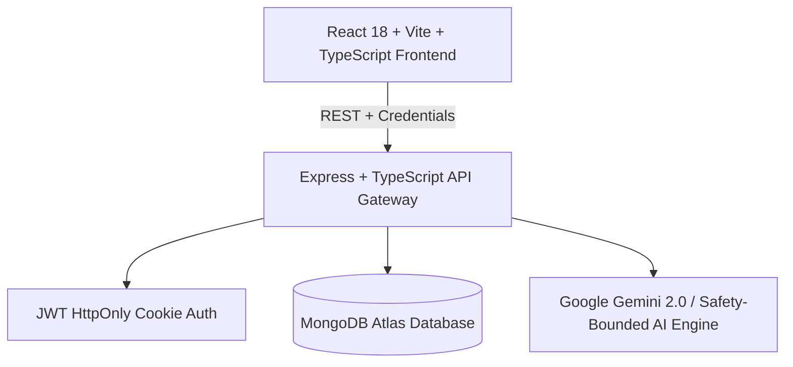

# 🌿 Carely — AI Medical Assistance Platform

> **A calm, intelligent healthcare companion designed to simplify patient navigation, organize medical records, manage appointments, and deliver safety-bounded health guidance.**

[](https://reactjs.org/)
[](https://nodejs.org/)
[](https://www.mongodb.com/)
[](LICENSE)

---

## 📑 Table of Contents

1. [🌟 Purpose & Mission](#-purpose--mission)
2. [✨ How Carely Helps (Benefits & Value)](#-how-carely-helps-benefits--value)
   - [For Patients](#1-for-patients)
   - [For Doctors & Care Teams](#2-for-doctors--care-teams)
   - [For Healthcare Administrators](#3-for-healthcare-administrators)
3. [⚙️ How It Works (Architecture & Flow)](#️-how-it-works-architecture--flow)
   - [High-Level Architecture](#high-level-architecture)
   - [End-to-End Workflow & Data Flow](#end-to-end-workflow--data-flow)
   - [Safety-Bounded AI Seam](#safety-bounded-ai-seam)
4. [🚀 Core Features & Modules](#-core-features--modules)
5. [💻 Tech Stack & Design System](#-tech-stack--design-system)
6. [🛠️ Installation & Setup Guide](#️-installation--setup-guide)
   - [Prerequisites](#prerequisites)
   - [1. Clone & Install Dependencies](#1-clone--install-dependencies)
   - [2. Environment Configuration](#2-environment-configuration)
   - [3. Running Locally](#3-running-locally)
7. [📖 Step-by-Step Usage Guide](#-step-by-step-usage-guide)
8. [📡 API Reference](#-api-reference)
9. [🛡️ Security, Privacy & Compliance](#️-security-privacy--compliance)
10. [🚢 Production Deployment Checklist](#-production-deployment-checklist)

---

## 🌟 Purpose & Mission

Healthcare today is fragmented, intimidating, and overwhelming. Patients face confusing medical jargon, lost lab reports, forgotten prescription schedules, and long waits between doctor visits.

**Carely** was created to bridge this gap with a **calm, patient-first digital ecosystem**:
- **Demystify Medical Information:** Translate complex diagnostic notes, lab findings, and medication schedules into plain, accessible language.
- **Support, Never Replace, Clinicians:** Deliver responsible AI health education that prepares patients for doctor visits without attempting autonomous diagnosis or prescription.
- **Centralize Health Management:** Unify appointment booking, medical history storage, digital prescriptions, and daily medication adherence reminders into one accessible dashboard.
- **Empower All Stakeholders:** Offer tailored experiences for Patients, Clinicians (Doctors), and Platform Administrators.

---

## ✨ How Carely Helps (Benefits & Value)

### 1. For Patients
- 🌿 **Reduced Anxiety:** Softer, claymorphism-inspired UI and gentle language prevent medical overwhelm.
- 💡 **Clarity Before Visits:** The AI Assistant helps patients organize symptoms and formulate clear questions for their doctor.
- ⏰ **Medication Adherence:** Daily reminder tracking with toggleable active/paused states ensures treatments are followed consistently.
- 📂 **Digital Record Hub:** Centralized storage for lab results, imaging reports, and doctor notes accessible anywhere.
- 📅 **Hassle-Free Booking:** Search available clinicians, pick convenient slots, and manage cancellations in real time.

### 2. For Doctors & Care Teams
- 🩺 **Streamlined Consultations:** Patients arrive better informed, with organized symptom histories and structured questions.
- 🗓️ **Live Schedule Visibility:** Instant oversight of upcoming patient consultations and appointment states (`scheduled`, `completed`, `cancelled`).
- 📋 **Integrated Patient History & Prescriptions:** Quick reference to patient-uploaded lab results, digital prescription issuance, and clinical note management.

### 3. For Healthcare Administrators
- 📊 **Operational Analytics:** Real-time metrics on total registered patients, active doctors, scheduled visits, and uploaded medical records.
- 🔐 **Role-Based Access Control (RBAC):** Strict partition between patient records, clinician tools, and system administration with live role modification.

---

## ⚙️ How It Works (Architecture & Flow)

### High-Level Architecture

Carely is structured as a full-stack monorepo leveraging npm workspaces:



### Safety-Bounded AI Seam

Carely implements strict ethical and clinical guardrails in its AI layer:
1. **No Autonomous Diagnosis:** The AI explicitly clarifies that it does not diagnose illnesses or conditions.
2. **No Prescription Generation:** It never recommends dosage changes or unprescribed medications.
3. **Clinical Visit Preparation:** It structures symptom timelines and formulates questions to ask a doctor.
4. **Emergency Escalation:** Severe or acute symptoms immediately prompt emergency service warnings.

---

## 🚀 Core Features & Modules

| Module | Features & Capabilities | Role Access |
| :--- | :--- | :--- |
| **Landing & Onboarding** | Claymorphism landing page, animated preview cards, responsive navigation, user registration, and login. | Public |
| **Patient Overview** | Dynamic wellness snapshot, activity tracker, quick reminder widgets, and fast AI entry points. | Patient |
| **Appointments Manager** | Search care team clinicians, select date and consultation slot, view scheduled appointments, and cancel visits. | Patient, Doctor |
| **Medication Reminders** | Add prescription/supplement reminders with dosage and schedules; toggle active/paused statuses. | Patient |
| **Medical Records Hub** | Organize lab results, imaging, visit notes, and attach secure file URLs with upload date tracking. | Patient, Doctor |
| **Digital Prescriptions** | Issue medications, specify dosage and schedules, review active patient treatments. | Patient, Doctor, Admin |
| **Patient Directory** | Clinician roster of all registered patients under care with visit metrics. | Doctor, Admin |
| **User Management** | Account control table to assign and modify roles (`patient`, `doctor`, `admin`) and remove accounts. | Admin |
| **Notifications Hub** | Real-time alerts for booking confirmations, cancellations, medication reminders, and system notes. | Authenticated Users |
| **Help & Privacy Center** | Emergency guidance (911/112), interactive FAQ accordion, HIPAA data commitments, support contact form. | Authenticated Users |
| **AI Health Assistant** | Plain-language health guidance, report translation, symptom tracking advice, and doctor visit prep. | Authenticated Users |
| **Doctor Workspace** | View assigned appointments, consult schedule, access records, and review consultation lists. | Doctor |
| **Admin Operations** | System-wide statistics (registered patients, clinician count, total visits, total records). | Admin |

---

## 💻 Tech Stack & Design System

### Frontend
- **Framework:** React 18 with TypeScript
- **Bundler & Tooling:** Vite, PostCSS
- **Routing:** React Router v6 (Nested layout, protected routes, role routing)
- **Animations:** Framer Motion (Smooth physics, floating elements, micro-interactions)
- **Iconography:** Lucide React
- **Design System:** Custom CSS design tokens, Claymorphism aesthetics, soft pastel glass gradients, modern typography.

### Backend
- **Runtime & Framework:** Node.js (ES Modules), Express 4 with TypeScript (`tsx` runtime)
- **Database:** MongoDB & Mongoose schemas with indexes, timestamps, and validation
- **Security:** Helmet (HTTP header security), CORS with origin allowlisting, Express Rate Limit
- **Authentication:** JSON Web Tokens (JWT) stored in `HttpOnly`, `SameSite`, `Secure` cookies, `bcryptjs` password hashing (salt rounds: 12)
- **Validation:** Zod schemas for all payload validation
- **AI Integration:** Google Gemini 2.0 Flash API with fallback to structured clinical guidance

---

## 🛠️ Installation & Setup Guide

### Prerequisites
- **Node.js:** v18.0.0 or higher ([Download Node.js](https://nodejs.org/))
- **npm:** v9.0.0 or higher
- **MongoDB:** MongoDB Atlas connection URI or local MongoDB instance

---

### 1. Clone & Install Dependencies

```bash
# Clone the repository
git clone https://github.com/jamesyuvaraj27/ai-medical-assistance.git
cd carely

# Install dependencies for root, frontend, and backend
npm install
```

---

### 2. Environment Configuration

#### Backend Configuration
Copy `backend/.env.example` to `backend/.env`:

```bash
cp backend/.env.example backend/.env
```

Edit `backend/.env`:

```env
PORT=4000
CLIENT_ORIGIN=http://localhost:5173,http://localhost:3000
JWT_SECRET=your-random-32-character-secret-key-here
MONGODB_URI=mongodb+srv://<username>:<password>@cluster.mongodb.net/carely?retryWrites=true&w=majority
GEMINI_API_KEY=your-gemini-api-key-optional
COOKIE_SECURE=false
```

#### Frontend Configuration
Copy `frontend/.env.example` to `frontend/.env`:

```bash
cp frontend/.env.example frontend/.env
```

Edit `frontend/.env`:

```env
VITE_API_URL=http://localhost:4000/api
```

---

### 3. Running Locally

```bash
# Start backend API (Terminal 1)
npm run server:dev

# Start frontend application (Terminal 2)
npm run dev
```

---

## 📄 License

This project is licensed under the [MIT License](LICENSE).
