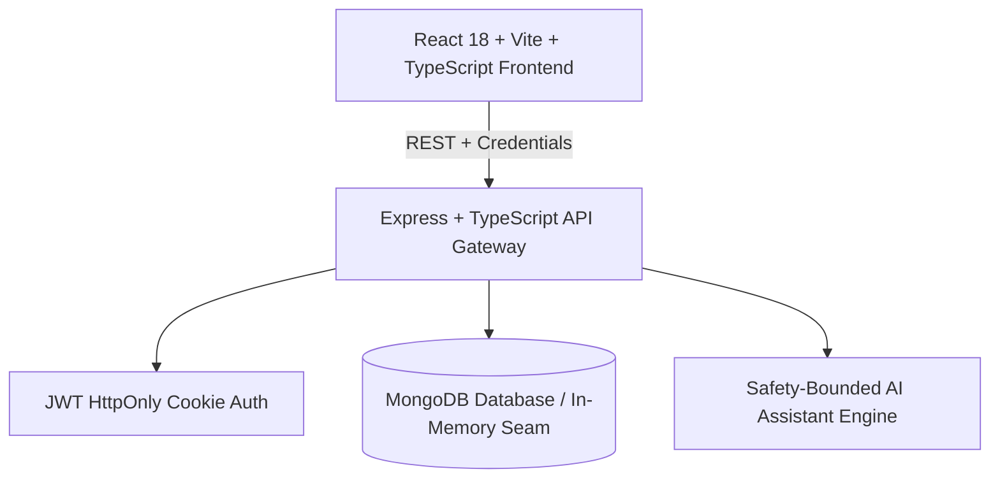
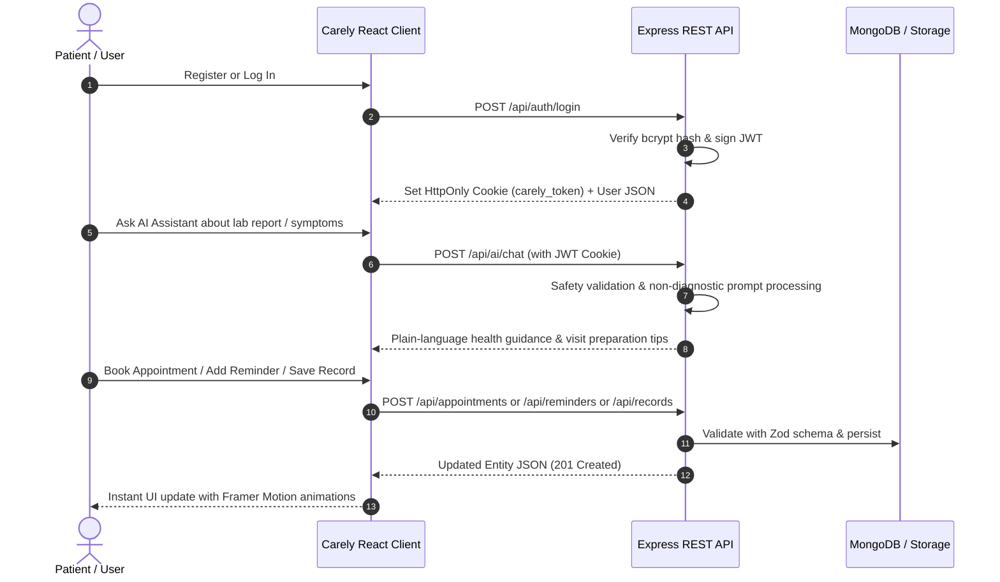

# 🌿 Carely — AI Medical Assistance Platform

> **A calm, intelligent healthcare companion designed to simplify patient navigation, organize medical records, manage appointments, and deliver safety-bounded health guidance.**

[](https://reactjs.org/)
[](https://nodejs.org/)
[](https://www.mongodb.com/)
[](LICENSE)

---

## 📑 Table of Contents

1. [🌟 Purpose & Mission](#-purpose--mission)
2. [✨ How Carely Helps (Benefits & Value)](#-how-carely-helps-benefits--value)
   - [For Patients](#1-for-patients)
   - [For Doctors & Care Teams](#2-for-doctors--care-teams)
   - [For Healthcare Administrators](#3-for-healthcare-administrators)
3. [⚙️ How It Works (Architecture & Flow)](#️-how-it-works-architecture--flow)
   - [High-Level Architecture](#high-level-architecture)
   - [End-to-End Workflow & Data Flow](#end-to-end-workflow--data-flow)
   - [Safety-Bounded AI Seam](#safety-bounded-ai-seam)
4. [🚀 Core Features & Modules](#-core-features--modules)
5. [💻 Tech Stack & Design System](#-tech-stack--design-system)
6. [🛠️ Installation & Setup Guide](#️-installation--setup-guide)
   - [Prerequisites](#prerequisites)
   - [1. Clone & Install Dependencies](#1-clone--install-dependencies)
   - [2. Environment Configuration](#2-environment-configuration)
   - [3. Running Locally](#3-running-locally)
7. [📖 Step-by-Step Usage Guide](#-step-by-step-usage-guide)
8. [📡 API Reference](#-api-reference)
9. [🛡️ Security, Privacy & Compliance](#️-security-privacy--compliance)
10. [🚢 Production Deployment Checklist](#-production-deployment-checklist)

---

## 🌟 Purpose & Mission

Healthcare today is fragmented, intimidating, and overwhelming. Patients face confusing medical jargon, lost lab reports, forgotten prescription schedules, and long waits between doctor visits.

**Carely** was created to bridge this gap with a **calm, patient-first digital ecosystem**:
- **Demystify Medical Information:** Translate complex diagnostic notes, lab findings, and medication schedules into plain, accessible language.
- **Support, Never Replace, Clinicians:** Deliver responsible AI health education that prepares patients for doctor visits without attempting autonomous diagnosis or prescription.
- **Centralize Health Management:** Unify appointment booking, medical history storage, and daily medication adherence reminders into one accessible dashboard.
- **Empower All Stakeholders:** Offer tailored experiences for Patients, Clinicians (Doctors), and Platform Administrators.

---

## ✨ How Carely Helps (Benefits & Value)

### 1. For Patients
- 🌿 **Reduced Anxiety:** Softer, claymorphism-inspired UI and gentle language prevent medical overwhelm.
- 💡 **Clarity Before Visits:** The AI Assistant helps patients organize symptoms and formulate clear questions for their doctor.
- ⏰ **Medication Adherence:** Daily reminder tracking with toggleable active/paused states ensures treatments are followed consistently.
- 📂 **Digital Record Hub:** Centralized storage for lab results, imaging reports, and doctor notes accessible anywhere.
- 📅 **Hassle-Free Booking:** Search available clinicians, pick convenient slots, and manage cancellations in real time.

### 2. For Doctors & Care Teams
- 🩺 **Streamlined Consultations:** Patients arrive better informed, with organized symptom histories and structured questions.
- 🗓️ **Live Schedule Visibility:** Instant oversight of upcoming patient consultations and appointment states (`scheduled`, `completed`, `cancelled`).
- 📋 **Integrated Patient History:** Quick reference to patient-uploaded lab results and medical records.

### 3. For Healthcare Administrators
- 📊 **Operational Analytics:** Real-time metrics on total registered patients, active doctors, scheduled visits, and uploaded medical records.
- 🔐 **Role-Based Access Control (RBAC):** Strict partition between patient records, clinician tools, and system administration.

---

## ⚙️ How It Works (Architecture & Flow)

### High-Level Architecture

Carely is structured as a full-stack monorepo leveraging npm workspaces:



### End-to-End Workflow & Data Flow



### Safety-Bounded AI Seam

Carely implements strict ethical and clinical guardrails in its AI layer:
1. **No Autonomous Diagnosis:** The AI explicitly clarifies that it does not diagnose illnesses or conditions.
2. **No Prescription Generation:** It never recommends dosage changes or unprescribed medications.
3. **Clinical Visit Preparation:** It structures symptom timelines and formulates questions to ask a doctor.
4. **Emergency Escalation:** Severe or acute symptoms immediately prompt emergency service warnings.

---

## 🚀 Core Features & Modules

| Module | Features & Capabilities | Role Access |
| :--- | :--- | :--- |
| **Landing & Onboarding** | Claymorphism landing page, animated preview cards, responsive navigation, user registration, and login. | Public |
| **Patient Overview** | Dynamic wellness snapshot, activity tracker, quick reminder widgets, and fast AI entry points. | Patient |
| **Appointments Manager** | Search care team clinicians, select date and consultation slot, view scheduled appointments, and cancel visits. | Patient, Doctor |
| **Medication Reminders** | Add prescription/supplement reminders with dosage and schedules; toggle active/paused statuses. | Patient |
| **Medical Records Hub** | Organize lab results, imaging, visit notes, and attach secure file URLs with upload date tracking. | Patient, Doctor |
| **AI Health Assistant** | Plain-language health guidance, report translation, symptom tracking advice, and doctor visit prep. | Authenticated Users |
| **Doctor Workspace** | View assigned appointments, consult schedule, access records, and review consultation lists. | Doctor |
| **Admin Operations** | System-wide statistics (registered patients, clinician count, total visits, total records). | Admin |

---

## 💻 Tech Stack & Design System

### Frontend
- **Framework:** React 18 with TypeScript
- **Bundler & Tooling:** Vite, PostCSS
- **Routing:** React Router v6 (Nested layout, protected routes, role routing)
- **Animations:** Framer Motion (Smooth physics, floating elements, micro-interactions)
- **Iconography:** Lucide React
- **Design System:** Custom CSS design tokens, Claymorphism aesthetics, soft pastel glass gradients, modern typography.

### Backend
- **Runtime & Framework:** Node.js (ES Modules), Express 4 with TypeScript (`tsx` runtime)
- **Security:** Helmet (HTTP header security), CORS with origin allowlisting, Express Rate Limit
- **Authentication:** JSON Web Tokens (JWT) stored in `HttpOnly`, `SameSite`, `Secure` cookies, `bcryptjs` password hashing (salt rounds: 12)
- **Validation:** Zod schemas for all payload validation
- **Persistence:** Mongoose / MongoDB connection with deterministic in-memory fallback store

---

## 🛠️ Installation & Setup Guide

### Prerequisites
- **Node.js:** v18.0.0 or higher ([Download Node.js](https://nodejs.org/))
- **npm:** v9.0.0 or higher
- **MongoDB:** (Optional for local dev, required for production) Local MongoDB instance or MongoDB Atlas URI

---

### 1. Clone & Install Dependencies

Clone the repository and install dependencies across all workspace packages:

```bash
# Clone the repository
git clone https://github.com/jamesyuvaraj27/ai-medical-assistance.git
cd carely

# Install dependencies for root, frontend, and backend
npm install
```

---

### 2. Environment Configuration

#### Backend Configuration
Copy the sample environment file in `backend/`:

```bash
cp backend/.env.example backend/.env
```

Edit `backend/.env` with your settings:

```env
PORT=4000
# Comma-separated allowed frontend origins
CLIENT_ORIGIN=http://localhost:5173,http://localhost:3000
# Long random secret (minimum 32 characters in production)
JWT_SECRET=super-secret-carely-development-key-32-chars-long
# MongoDB connection URI (optional in local dev; falls back to in-memory store)
MONGODB_URI=mongodb+srv://<username>:<password>@cluster.mongodb.net/carely?retryWrites=true&w=majority
# Set to true when running under HTTPS
COOKIE_SECURE=false
```

#### Frontend Configuration
Copy the sample environment file in `frontend/`:

```bash
cp frontend/.env.example frontend/.env
```

Edit `frontend/.env`:

```env
# URL pointing to the Express API
VITE_API_URL=http://localhost:4000/api
```

---

### 3. Running Locally

You can run both frontend and backend using root npm scripts:

#### Option A: Run Both Simultaneously (Separate Terminals)

**Terminal 1 — Backend Server:**
```bash
npm run server:dev
```
*API will start at `http://localhost:4000`*

**Terminal 2 — Frontend App:**
```bash
npm run dev
```
*Frontend will start at `http://localhost:5173`*

#### Option B: Individual Workspace Commands

```bash
# Backend only
npm run dev --workspace backend

# Frontend only
npm run dev --workspace frontend
```

---

## 📖 Step-by-Step Usage Guide

### 1. Creating an Account & Logging In
1. Open `http://localhost:5173` in your browser.
2. Click **Get started** or navigate to `/register`.
3. Enter your Full Name, Email, and Password (minimum 8 characters).
4. Click **Create my account** to be automatically authenticated and redirected to `/patient`.

> **Note for Testing Demo Doctor:** When running in local development mode with the in-memory fallback, a pre-seeded demo doctor account is available:
> - **Email:** `amara.patel@carely.example`
> - **Password:** `development-only-password`

### 2. Booking a Doctor Appointment
1. From the sidebar, navigate to **Appointments** (`/patient/appointments`).
2. Select your clinician from the dropdown list.
3. Choose a preferred date and time slot (`10:00 AM`, `2:00 PM`, `4:30 PM`).
4. Click **Request appointment**. The appointment will appear in your appointments list.
5. To cancel, click the **Cancel** button next to any scheduled visit.

### 3. Adding Medication & Habit Reminders
1. Navigate to **Reminders** (`/patient/reminders`).
2. Enter the medicine/supplement name (e.g., *Vitamin D3*), dosage (*1000 IU*), and schedule time (*8:00 AM*).
3. Click **Add reminder**.
4. Use the **Active / Paused** toggle button to adjust reminder states.

### 4. Uploading Medical Records
1. Navigate to **Medical records** (`/patient/records`).
2. Provide a record title (*Annual Blood Panel*), category (*Lab result, Imaging, Prescription, Visit note*), and an optional secure document URL.
3. Click **Save record** to store it in your health story.

### 5. Chatting with the AI Health Assistant
1. Navigate to **AI assistant** (`/patient/assistant`).
2. Type a health-related question, symptom description, or request for lab report explanation.
3. Click **Ask Carely** to receive safety-bounded, plain-language guidance and consultation preparation tips.

---

## 📡 API Reference

All protected endpoints require the `carely_token` HttpOnly cookie issued upon successful login or registration.

### 🔐 Authentication

| Method | Endpoint | Access | Description |
| :--- | :--- | :--- | :--- |
| `POST` | `/api/auth/register` | Public | Register new patient account |
| `POST` | `/api/auth/login` | Public | Authenticate user & issue JWT cookie |
| `POST` | `/api/auth/logout` | Authenticated | Clear session cookie |
| `GET` | `/api/auth/me` | Authenticated | Fetch current authenticated session |

### 🩺 Clinicians & Appointments

| Method | Endpoint | Access | Description |
| :--- | :--- | :--- | :--- |
| `GET` | `/api/doctors` | Public | List all registered doctors |
| `GET` | `/api/appointments` | Patient / Doctor | List user's appointments |
| `POST` | `/api/appointments` | Patient | Request a new appointment |
| `PATCH` | `/api/appointments/:id/cancel` | Patient / Doctor | Cancel a scheduled appointment |

### ⏰ Reminders

| Method | Endpoint | Access | Description |
| :--- | :--- | :--- | :--- |
| `GET` | `/api/reminders` | Patient | Retrieve all medication reminders |
| `POST` | `/api/reminders` | Patient | Create a new reminder |
| `PATCH` | `/api/reminders/:id` | Patient | Toggle reminder active/paused state |

### 📁 Medical Records

| Method | Endpoint | Access | Description |
| :--- | :--- | :--- | :--- |
| `GET` | `/api/records` | Patient / Doctor | Retrieve medical records |
| `POST` | `/api/records` | Patient | Save a new medical record entry |

### 🤖 AI Assistant & Platform

| Method | Endpoint | Access | Description |
| :--- | :--- | :--- | :--- |
| `POST` | `/api/ai/chat` | Authenticated | Receive safety-bounded health guidance |
| `GET` | `/api/admin/stats` | Admin | Fetch system analytics and counts |
| `GET` | `/api/health` | Public | Service health & database connectivity check |

---

## 🛡️ Security, Privacy & Compliance

- **HttpOnly Cookies:** JWT tokens are stored in `HttpOnly`, `SameSite=None/Lax` cookies to prevent Cross-Site Scripting (XSS) token theft.
- **Password Security:** Passwords hashed with `bcryptjs` using 12 salt rounds before storage.
- **Input Sanitization:** All request payloads are strictly validated using `Zod` schemas.
- **Security Headers:** `helmet` middleware sets secure HTTP headers (HSTS, CSP, X-Frame-Options).
- **Rate Limiting:** Protection against brute force and DoS attacks (300 requests / 15-minute window).
- **CORS Allowlist:** Origin verification restricts API access to authorized frontend domains.

---

## 🚢 Production Deployment Checklist

When deploying Carely to production environments (e.g., Render, Railway, AWS, Vercel):

- [ ] **Database Persistence:** Configure a production `MONGODB_URI` cluster (e.g. MongoDB Atlas) and wire Mongoose database queries.
- [ ] **Secret Management:** Generate a cryptographically secure `JWT_SECRET` (at least 32 random characters).
- [ ] **Cookie Security:** Set `COOKIE_SECURE=true` and configure `COOKIE_SAMESITE=none` (if frontend and backend are hosted on separate domains under HTTPS).
- [ ] **Origin Allowlist:** Set `CLIENT_ORIGIN` to the exact production frontend URL(s).
- [ ] **AI Provider Integration:** Connect `/api/ai/chat` to a production LLM API (Google Gemini, OpenAI, or Anthropic) with health-domain system prompts and safety filters.
- [ ] **File Storage:** Integrate Amazon S3, Google Cloud Storage, or Cloudinary for encrypted medical document and lab report uploads.

---

## 📄 License

This project is licensed under the [MIT License](LICENSE).
